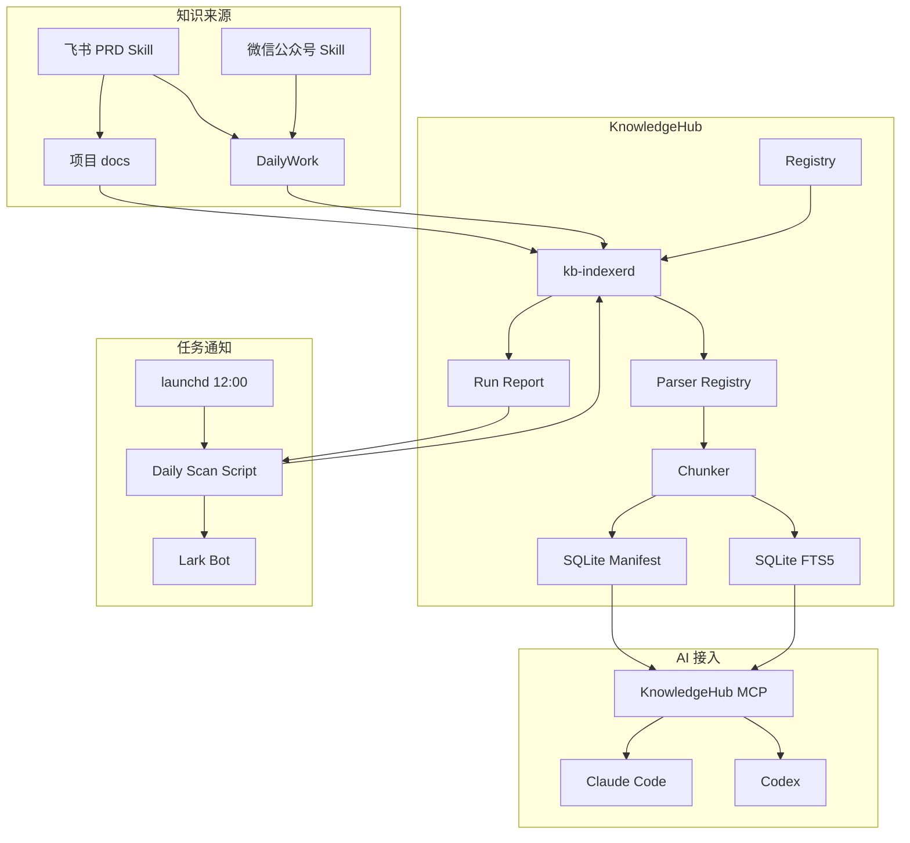
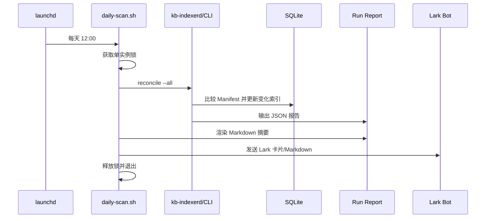

# KnowledgeHub 技术实现方案

- 文档版本：V1.1
- 编写日期：2026-07-16
- V1.1 更新：吸收设计复核意见，明确 FTS Chunk 关联、Scope 过滤、中文检索评估、CLI 语义、PID 锁和休眠补偿策略
- 项目目录：`/Users/your-user/KnowledgeHub`
- 运行平台：macOS，时区 `Asia/Shanghai`
- 当前状态：V1.1 设计已落地为 KnowledgeHub 0.1.0；Indexer、CLI、SQLite/FTS5、只读 MCP、Lark 摘要和 launchd 部署均已实现

## 1. 建设目标

KnowledgeHub 用于统一管理分散在多个本地目录中的知识文件，在不搬运、不重写原始文件的前提下，实现：

1. 注册日常工作、业务项目等多个知识库地址。
2. 每天中午 12:00 自动扫描全部已启用知识库。
3. 只对新增、变化、删除或移动的文件更新索引。
4. 每次任务结束后，通过 Lark 群机器人同步扫描摘要。
5. 通过只读 MCP Server 同时为 Claude Code 和 Codex 提供全文检索。
6. 返回文档绝对路径、标题、章节、行号和原文片段，确保回答可追溯。
7. 默认拒绝索引凭据、私钥、Token、`.env` 和构建产物。

## 2. 非目标

V1 不包含以下能力：

- 不替代 Git、Obsidian 或项目文档目录。
- 不自动修改、删除或移动项目知识文件。
- 不自动提交 Git。
- 不把完整项目上传到云端模型。
- 不保存对话流水账。
- 不把操作流程重复写入 cc-memory；稳定流程由 Skill 管理。
- 不在第一版引入复杂向量数据库，先保证中文全文搜索、项目背景和引用准确。

## 3. 核心原则

### 3.1 原文就地保存

项目专属知识写在对应项目中：

```text
/Users/your-user/workspace/<project>/docs/
```

跨项目和个人资料写在：

```text
/Users/your-user/KnowledgeBases/DailyWork/
```

KnowledgeHub 只建立索引，不创建第二份副本。

### 3.2 写入和索引分离

- Ingestor/Skill：负责创建或更新 Markdown、图片和原始快照。
- Indexer：只读取文件并更新索引。
- MCP Server：只查询索引和读取命中的原文章节。

### 3.3 单写多读

- `kb-indexerd` 是索引数据库的唯一写入者。
- Claude、Codex 和 CLI 可以并发只读查询。
- SQLite 使用 WAL 模式，读取不阻塞索引更新。

### 3.4 主动通知 + 扫描补偿

- Skill 写入完成后可以调用 `kb notify <path>`，立即更新。
- 每天 12:00 仍执行磁盘与 Manifest 对账，补偿漏事件。
- V1 不依赖常驻文件监听；后续可增加 FSEvents/watchdog 实时监听。

## 4. 总体架构



## 5. 代码结构

当前 0.1.0 使用 Python 3.12。为控制 V1 实现复杂度，实际代码采用扁平模块；下列分层目录是后续规模扩大时的推荐拆分目标：

```text
/Users/your-user/KnowledgeHub/
├── pyproject.toml
├── README.md
├── src/
│   └── knowledgehub/
│       ├── __init__.py
│       ├── cli.py
│       ├── config.py
│       ├── registry.py
│       ├── models.py
│       ├── database.py
│       ├── security.py
│       ├── reporting.py
│       ├── notifier.py
│       ├── indexer/
│       │   ├── service.py
│       │   ├── scanner.py
│       │   ├── detector.py
│       │   ├── hasher.py
│       │   ├── chunker.py
│       │   └── updater.py
│       ├── parsers/
│       │   ├── base.py
│       │   ├── markdown.py
│       │   ├── text.py
│       │   ├── html.py
│       │   ├── structured.py
│       │   ├── pdf.py
│       │   └── docx.py
│       └── mcp/
│           ├── server.py
│           └── tools.py
├── tests/
│   ├── unit/
│   ├── integration/
│   └── fixtures/
├── config/
├── deploy/
├── scripts/
├── index/
├── run/
├── cache/
└── logs/
```

推荐依赖：

```text
PyYAML              配置
pydantic            配置和数据模型校验
python-frontmatter  Markdown YAML 元数据
markdown-it-py      Markdown 结构解析
beautifulsoup4      HTML 正文解析
watchdog            可选实时监听
mcp                  MCP Server SDK
```

SQLite、`hashlib`、`pathlib`、`logging`、`asyncio` 使用 Python 标准库。

## 6. 配置注册表

主配置文件：

```text
/Users/your-user/KnowledgeHub/config/knowledge-bases.yaml
```

首次初始化：

```bash
cp \
  /Users/your-user/KnowledgeHub/config/knowledge-bases.example.yaml \
  /Users/your-user/KnowledgeHub/config/knowledge-bases.yaml
```

配置必须包含：

- KnowledgeHub 数据库、日志和运行目录。
- 时区。
- 每日扫描计划。
- Lark 通知方式。
- 知识库 ID、物理根目录、项目 ID。
- include/exclude 规则。
- 单文件大小限制。
- 全文搜索 Tokenizer。

不建议直接把整个 `/Users/your-user/workspace` 无限制加入扫描。业务知识库应注册明确项目，或者只允许 `README.md`、`docs/**`、`.ai/PROJECT_CONTEXT.md` 等白名单路径。

## 7. Indexer 职责

Indexer 负责：

1. 读取知识库注册表。
2. 遍历 include 允许、exclude 未拒绝的文件。
3. 将磁盘文件列表与 `documents` Manifest 对比。
4. 使用 `size + mtime_ns` 做快速变化判断。
5. 对疑似变化文件计算 SHA-256。
6. 内容未变化时仅更新文件属性。
7. 内容变化时解析文档、切分章节并事务更新索引。
8. 磁盘文件消失时移除失效章节和 FTS 数据。
9. 解析失败时保留上一版可用索引。
10. 生成机器可读 JSON 报告和人类可读 Markdown 摘要。

Indexer 不负责：

- 改写原始文件。
- 自动覆盖 PRD。
- 自动下载外部文档。
- 自动提交 Git。
- 在日志中打印敏感内容。

## 8. 文件变化检测

### 8.1 V1：每日 Reconcile

每天 12:00 运行：

```bash
kb reconcile --all --report-json <report-path>
```

算法：

```text
读取 Registry
  ↓
枚举允许的磁盘文件
  ↓
加载数据库 Manifest
  ↓
按 kb_id + realpath 对比
  ↓
新增文件 → 计算 Hash → 解析 → 建索引
疑似修改 → 比较 size/mtime → 计算 Hash → 必要时重建
路径消失 → 删除文档章节和全文索引
Hash 相同 → 跳过重建，仅更新文件属性
疑似删除 → 等待删除宽限期并再次确认 → 删除或恢复正常
  ↓
提交事务
  ↓
生成 Run Report
```

`delete_grace_seconds` 表示“文件第一次被观察为不存在后，在真正删除索引前等待的最短时间”。Indexer 必须在宽限期结束后重新 `stat` 目标路径：若文件恢复则取消删除；仍不存在才删除 `documents/chunks/chunks_fts`。每日 Reconcile 可以只对疑似删除路径进行一次延迟复查，不需要重新扫描全部目录；实时监听则通过延迟任务复查。该参数用于规避编辑器原子替换、Git checkout 和短暂挂载抖动造成的误删除，不是索引保留天数。

### 8.2 V2：实时监听

后续可使用 watchdog/FSEvents 监听：

- created
- modified
- moved
- deleted

实时事件必须经过：

```text
800ms 防抖
  +
文件 size/mtime 连续两次稳定
  +
SHA-256 内容确认
```

文件事件只是快速提示，不能替代每日 Reconcile。

### 8.3 Skill 主动通知

飞书 PRD 或微信文章 Skill 写入完成后：

```bash
kb notify /absolute/path/to/document.md
```

主动通知失败不应回滚文档写入；每日扫描会最终补偿。

## 9. 文件身份与去重

文档唯一键：

```text
kb_id + canonical_realpath
```

辅助字段：

- inode：帮助识别同盘重命名。
- SHA-256：确认内容一致、帮助去重。
- source_url/source_id：识别同一外部来源。

重命名优先按 inode 或 content_hash 识别；识别失败时按“旧文件删除 + 新文件创建”处理，结果仍然正确。

符号链接默认不递归跟随，避免循环和重复索引。确需支持时，必须配置允许的真实路径范围。

已知限制：`canonical_realpath` 依赖挂载路径稳定。V1 面向本机 `/Users/...` 目录，该限制可接受；外置硬盘、NAS 或挂载点可能变化的目录需要配置稳定的逻辑 root id，并在 V2 引入 `root_id + relative_path` 身份或挂载迁移工具，避免同一文档被识别为删除后新增。

## 10. 数据库设计

数据库路径：

```text
/Users/your-user/KnowledgeHub/index/knowledge.db
```

### 10.1 knowledge_bases

```sql
CREATE TABLE knowledge_bases (
    id TEXT PRIMARY KEY,
    name TEXT NOT NULL,
    type TEXT NOT NULL,
    enabled INTEGER NOT NULL DEFAULT 1,
    config_hash TEXT NOT NULL,
    created_at TEXT NOT NULL,
    updated_at TEXT NOT NULL
);
```

### 10.2 documents

```sql
CREATE TABLE documents (
    id TEXT PRIMARY KEY,
    kb_id TEXT NOT NULL,
    project_id TEXT,
    absolute_path TEXT NOT NULL,
    real_path TEXT NOT NULL,
    relative_path TEXT NOT NULL,
    file_type TEXT NOT NULL,
    title TEXT,
    document_type TEXT,
    version TEXT,
    source_url TEXT,
    source_id TEXT,
    size INTEGER NOT NULL,
    mtime_ns INTEGER NOT NULL,
    inode INTEGER,
    content_hash TEXT NOT NULL,
    status TEXT NOT NULL,
    parse_error TEXT,
    indexed_at TEXT,
    created_at TEXT NOT NULL,
    updated_at TEXT NOT NULL,
    UNIQUE(kb_id, real_path)
);

CREATE INDEX idx_documents_scope
    ON documents(kb_id, project_id, id);
```

### 10.3 chunks

```sql
CREATE TABLE chunks (
    id TEXT PRIMARY KEY,
    document_id TEXT NOT NULL,
    ordinal INTEGER NOT NULL,
    heading TEXT,
    heading_path TEXT,
    content TEXT NOT NULL,
    start_line INTEGER,
    end_line INTEGER,
    content_hash TEXT NOT NULL,
    created_at TEXT NOT NULL,
    updated_at TEXT NOT NULL,
    FOREIGN KEY(document_id) REFERENCES documents(id) ON DELETE CASCADE
);
```

### 10.4 chunks_fts

V1 基线使用 FTS5 Trigram。FTS 行必须显式保存 `chunk_id`，禁止依赖虚表 `rowid` 与 `chunks` 表隐式同步：

```sql
CREATE INDEX idx_chunks_document
    ON chunks(document_id, ordinal);

CREATE VIRTUAL TABLE chunks_fts USING fts5(
    chunk_id UNINDEXED,
    document_id UNINDEXED,
    kb_id UNINDEXED,
    project_id UNINDEXED,
    title,
    heading,
    content,
    tokenize='trigram'
);
```

写入时 `chunks.id == chunks_fts.chunk_id`，命中后使用显式关联：

```sql
SELECT d.kb_id, d.project_id, d.absolute_path,
       c.id AS chunk_id, c.document_id, d.title,
       c.heading_path, c.start_line, c.end_line,
       bm25(chunks_fts) AS rank
FROM chunks_fts
JOIN chunks c ON c.id = chunks_fts.chunk_id
JOIN documents d ON d.id = c.document_id
WHERE chunks_fts MATCH :query
  AND (:kb_id IS NULL OR d.kb_id = :kb_id)
  AND (:project_id IS NULL OR d.project_id = :project_id)
ORDER BY rank
LIMIT :limit;
```

`kb_id/project_id` 在 FTS 中标记为 `UNINDEXED` 仅用于结果携带和诊断，不能依赖 `MATCH` 做 Scope 过滤。V1 的正确性优先路径是“FTS MATCH 后 JOIN `documents`，再用普通 SQL WHERE 做 Scope 过滤”；`documents(kb_id, project_id, id)` 和 `chunks(document_id, ordinal)` 必须建立普通索引。

Scope 很窄而全局命中很多时，数据库可能需要检查较多 FTS 命中。只有性能基准证明该路径不足时，才引入候选批次优化：从 `limit × 5` 开始分批取候选，过滤后不足 `limit` 就继续扩大或读取下一批，直到结果足够或 FTS 命中耗尽，禁止使用固定候选上限造成召回丢失。若规模达到约十万级 Chunk 后仍成为瓶颈，再评估按知识库拆分 FTS 表、维护 Scope 映射表或把 Scope 编码进独立检索字段，不能提前复杂化。

中文检索质量要求：

1. Trigram 作为 V1 基线，重点评估真实 PRD、架构文档和故障记录查询。
2. 单字、双字等短查询单独纳入测试；不得假设 Trigram 能稳定覆盖短词。
3. 建立至少 50 条真实查询的标注集，记录 Recall@10、MRR、无结果率和误召回样例。
4. 若基线不达标，在写入 FTS 前使用 jieba 预分词，将空格分隔的分词文本写入检索列，并切换为 `unicode61`；原文仍保存在 `chunks.content`，返回片段不得使用分词文本。
5. jieba 分词是可替换的索引策略，不改变 MCP 和 CLI 接口。

查询结果必须同时返回：

- `kb_id`
- `project_id`
- `document_id`
- `chunk_id`
- 绝对路径
- 标题
- heading_path
- start_line/end_line
- snippet
- rank

### 10.5 scan_runs

```sql
CREATE TABLE scan_runs (
    id TEXT PRIMARY KEY,
    scan_type TEXT NOT NULL,
    started_at TEXT NOT NULL,
    completed_at TEXT,
    status TEXT NOT NULL,
    discovered_count INTEGER NOT NULL DEFAULT 0,
    added_count INTEGER NOT NULL DEFAULT 0,
    updated_count INTEGER NOT NULL DEFAULT 0,
    deleted_count INTEGER NOT NULL DEFAULT 0,
    unchanged_count INTEGER NOT NULL DEFAULT 0,
    skipped_count INTEGER NOT NULL DEFAULT 0,
    error_count INTEGER NOT NULL DEFAULT 0,
    report_path TEXT,
    error_summary TEXT
);
```

## 11. 文档解析和切分

### 11.1 V1 支持类型

- Markdown
- Text
- HTML
- YAML
- JSON

### 11.2 V2 支持类型

- PDF
- Docx
- OCR 图片

### 11.3 Markdown 切分规则

优先按标题层级切分：

```text
# 文档标题
## 产品背景
## 功能需求
### 消息流控制
### Agent 编排
```

形成：

```text
产品背景
功能需求 / 消息流控制
功能需求 / Agent 编排
```

如果章节超过 6000 字符，再按段落二次切分，重叠 300 字符。禁止从代码块、Markdown 表格和列表中间切断。

### 11.4 解析失败

解析失败时：

1. 不删除上一版可用索引。
2. 将 `documents.parse_error` 更新为脱敏后的错误信息。
3. 计入本次报告 `error_count`。
4. Lark 摘要列出失败文件路径，不包含文件内容。
5. 下次扫描自动重试。

## 12. 索引事务

更新单个文档时：

```text
完成新版本解析
  ↓
BEGIN IMMEDIATE
  ↓
更新 documents
按显式 chunk_id 删除旧 chunks_fts，再删除旧 chunks
写入新 chunks，并以相同 chunk_id 写入 chunks_fts
  ↓
COMMIT
```

解析必须在事务外完成，避免长时间占用数据库写锁。

数据库建议启用：

```sql
PRAGMA journal_mode=WAL;
PRAGMA foreign_keys=ON;
PRAGMA busy_timeout=5000;
```

## 13. 每日 12:00 调度

macOS 使用用户级 launchd：

```text
~/Library/LaunchAgents/com.example.knowledgehub.daily-scan.plist
```

计划：

```text
每天，Hour=12，Minute=0，使用 macOS 当前本地时区。
```

执行链路：



### 13.1 互斥锁

防止手工扫描和定时扫描重叠：

```text
/Users/your-user/KnowledgeHub/run/daily-scan.lock
```

通过原子创建目录实现，锁目录内必须写入 `pid` 文件。若锁已存在：

- PID 存在且 `kill -0 <pid>` 成功：判定任务仍在运行，本次任务退出并记录“已有扫描运行中”。
- PID 不存在或格式损坏：仅当锁目录年龄超过 `stale_lock_seconds` 才允许清理。
- PID 已不存在：将旧锁目录原子移动为带当前 PID 的 stale 目录后清理，再重新竞争锁。
- 退出清理锁时必须确认 `pid` 文件仍等于当前进程 PID，禁止删除其他进程后来获得的锁。

模板默认 `stale_lock_seconds=21600`（6 小时），实现后应改为配置项。`kill -9`、进程崩溃或机器重启留下的锁不会永久阻塞后续扫描。

### 13.2 睡眠和离线

launchd 只能在用户会话和系统可执行任务时运行。Mac 在 12:00 休眠时，任务不保证恰好在 12:00 执行。因此：

- 脚本每次运行检查当天是否已经成功执行，并维护 `run/last-successful-daily-scan-date`。
- launchd 模板默认 `RunAtLoad=true`，登录或重新加载任务时补偿当天未执行任务。
- 当天已经成功执行时直接退出；人工确需重跑时使用 `--force`。
- 报告记录实际开始时间和计划时间。

## 14. Lark 机器人摘要

无人值守任务不依赖 Claude/Codex MCP 会话。使用 Lark 群机器人 Webhook 或现有本地通知脚本：

```text
/path/to/notification-script.sh
```

推荐通过配置注入脚本路径，而不是在 KnowledgeHub 中保存 Webhook。

### 14.1 成功且有更新

标题：

```text
KnowledgeHub 每日索引更新成功
```

正文示例：

```text
执行时间：2026-07-16 12:00:03 ～ 12:00:18
耗时：15 秒
扫描知识库：2
发现文件：326
新增：3
更新：5
删除：1
未变化：317
跳过：0
失败：0

分库：
- daily-work：新增 1，更新 2，删除 0
- business-dev：新增 2，更新 3，删除 1

索引状态：正常
报告：/Users/your-user/KnowledgeHub/logs/reports/2026-07-16T120003.json
```

### 14.2 成功但无更新

```text
KnowledgeHub 每日扫描完成
扫描文件：326
新增/更新/删除：0/0/0
索引没有变化，状态正常。
```

### 14.3 失败

```text
KnowledgeHub 每日扫描失败
执行时间：2026-07-16 12:00:03
阶段：parse
失败文件：/absolute/path/to/file.md
错误：Markdown parser failed（已脱敏）
旧索引：已保留
日志：/Users/your-user/KnowledgeHub/logs/daily-scan.err.log
```

### 14.4 通知失败

- 扫描成功与通知成功分别记录状态。
- 通知失败不回滚索引。
- 报告写入 `logs/outbox/`，后续重试三次。
- 禁止在错误日志中输出 Webhook URL 或 Token。

## 15. CLI 接口

`scan` 与 `reconcile` 语义固定如下：

- `kb scan`：面向指定 Scope/路径的快速增量扫描，只处理本次枚举到的新增或修改文件；默认不把未枚举到的其他 Manifest 记录判定为删除，适合手工局部刷新。
- `kb reconcile`：完整枚举选定知识库并与 Manifest 对账，可识别新增、修改、删除和重命名；“完整”指状态核对范围，不代表重建全部索引，Hash 未变化的文件仍跳过。每天 12:00 的正式任务统一调用该命令。
- `kb notify`：单文件快速提示；失败后由下一次 `reconcile` 补偿。

```bash
# 初始化数据库
kb init --config /Users/your-user/KnowledgeHub/config/knowledge-bases.yaml

# 每日全范围对账、仅增量重建变化内容
kb reconcile --all --report-json /absolute/path/report.json

# 手工快速扫描单个知识库，不执行全局删除对账
kb scan --scope business-dev

# 主动通知一个文件变化
kb notify /absolute/path/to/file.md

# 全文搜索
kb search "半双工消息流" --scope all --limit 10

# 读取命中章节
kb read --document-id <id> --chunk-id <id>

# 当前项目背景
kb project-context /Users/your-user/workspace/<project>

# 状态
kb status --json

# 校验配置
kb config validate
```

统一退出码：

| 退出码 | 含义 |
|---:|---|
| 0 | 成功 |
| 2 | 配置错误 |
| 3 | 部分文档解析失败，旧索引已保留 |
| 4 | 数据库错误 |
| 5 | 安全规则拒绝 |
| 6 | 已有扫描运行中 |
| 7 | Lark 通知失败但索引成功 |

## 16. MCP Server

MCP Server 默认只读，提供：

### 16.1 `kb_search`

```json
{
  "query": "半双工消息流",
  "scopes": ["daily-work", "business-dev"],
  "project_id": null,
  "limit": 10
}
```

### 16.2 `kb_read`

```json
{
  "document_id": "doc_xxx",
  "chunk_id": "chunk_xxx",
  "max_chars": 12000
}
```

### 16.3 `kb_project_context`

```json
{
  "project_path": "/Users/your-user/workspace/<project>"
}
```

### 16.4 `kb_status`

返回最后成功扫描、索引数量和异常状态。

### 16.5 强制引用规则

AI 回答项目事实时必须带：

```text
[kb_id] 文档标题
绝对路径
章节路径
行号范围
```

MCP 不提供直接覆盖文档、删除文件或写入索引数据库的工具。

## 17. Claude Code 接入

详细步骤见：

```text
/Users/your-user/KnowledgeHub/docs/CLAUDE_CODE_INTEGRATION.md
```

原则：

1. 用户级注册 `knowledgehub` MCP。
2. 项目 `CLAUDE.md` 指定什么时候必须检索。
3. 项目背景问题先调用 `kb_project_context`。
4. 搜索后必须调用 `kb_read` 读取原文章节。
5. 回答必须带来源路径。

## 18. Codex 接入

详细步骤见：

```text
/Users/your-user/KnowledgeHub/docs/CODEX_INTEGRATION.md
```

原则：

1. 在 `/Users/your-user/.codex/config.toml` 注册 MCP。
2. 在项目 `AGENTS.md` 写入检索纪律。
3. KnowledgeHub MCP 对 Codex 和 Claude 使用同一数据库和工具契约。
4. Codex 的代码结构分析继续优先使用 CodeGraph；KnowledgeHub 负责 PRD、架构、业务背景和历史文档。

## 19. 安全设计

### 19.1 路径拒绝规则

默认拒绝：

```text
.env
.env.*
*.pem
*.key
*.p12
*.jks
*secret*
*credential*
.git/
node_modules/
target/
build/
dist/
logs/
*.log
```

### 19.2 内容检测

解析前检查明显敏感模式。实现时必须使用流式读取、预编译正则、单行长度上限和最大扫描字节数；先执行廉价的固定前缀/关键词判断，再执行复杂正则。PDF/Docx 等解析产物同样受文本大小限制，禁止对超大文件一次性加载并执行全量回溯正则。需要用真实大文件做基准测试，确保敏感检测不会成为扫描主瓶颈。

检测模式包括：

- Private Key 头部
- Access Key/Secret Key 组合
- Bearer Token
- Password/Token 字段
- 大段 Base64 凭据

命中后：

- 不索引正文。
- 报告中只记录路径和规则名。
- 不打印具体敏感值。

### 19.3 Lark 凭据

允许方案：

1. 复用 `/path/to/notification-script.sh`。
2. 使用项目外的 `~/.config/knowledgehub/lark.env`，权限 `600`。
3. 使用 Keychain 或企业 Secret Manager。

禁止：

- 把 Webhook URL 写进 Git。
- 把 Token 写入 `knowledge-bases.yaml`。
- 把凭据写入 KnowledgeBase、cc-memory 或任务摘要。

## 20. 日志和报告

```text
/Users/your-user/KnowledgeHub/logs/
├── daily-scan.out.log
├── daily-scan.err.log
├── indexer.log
├── reports/
│   └── 2026-07-16T120003.json
└── outbox/
    └── pending-notification-*.json
```

日志保留：

- 普通日志 30 天。
- JSON 扫描报告 90 天。
- 错误报告 180 天或人工处理后归档。
- 不在日志中记录正文和凭据。

## 21. 可观测性

`kb status --json` 至少返回：

```json
{
  "status": "healthy",
  "last_successful_scan": "2026-07-16T12:00:18+08:00",
  "documents": 326,
  "chunks": 2135,
  "knowledge_bases": 2,
  "parse_errors": 0,
  "notification_pending": 0
}
```

健康状态：

| 状态 | 条件 |
|---|---|
| healthy | 最后扫描成功且无未处理错误 |
| degraded | 部分文档解析失败或通知待重试 |
| stale | 超过 26 小时没有成功扫描 |
| failed | 数据库不可用或扫描整体失败 |

## 22. 测试策略

### 22.1 单元测试

- include/exclude 匹配。
- SHA-256 和快速属性判断。
- Markdown 标题切分。
- 中文全文检索，包括单字、双字、长查询和 jieba 预分词切换。
- FTS 命中通过显式 chunk_id 正确关联 chunks/documents。
- Scope JOIN 过滤、候选批次自适应扩展及不丢召回的终止条件。
- 敏感路径和内容拒绝，以及大文件流式检测性能。
- Lark 摘要渲染。
- 报告统计。

### 22.2 集成测试

- 新增文件后建立索引。
- 内容变化后替换旧 chunks。
- 仅 mtime 变化、Hash 相同不重建。
- 删除文件经过 `delete_grace_seconds` 二次确认后移除索引，短暂消失后恢复的文件不误删。
- 重命名保持或正确重建文档身份。
- PID 存活锁、无 PID 新锁、死亡 PID stale lock 和并发抢锁行为正确。
- 解析失败保留旧索引。
- 两个知识库同名文件不冲突。
- Claude/Codex MCP 搜索返回一致结果。

### 22.3 调度测试

```bash
plutil -lint \
  /Users/your-user/KnowledgeHub/deploy/com.example.knowledgehub.daily-scan.plist.example

zsh -n \
  /Users/your-user/KnowledgeHub/scripts/knowledgehub-daily-scan.sh.example
```

真实发送前必须先运行：

```bash
knowledgehub-daily-scan.sh --dry-run
```

## 23. 备份和恢复

需要备份的是原始知识文件和配置；索引可以重建。

推荐备份：

```text
/Users/your-user/KnowledgeBases/
各项目 docs/
/Users/your-user/KnowledgeHub/config/
```

索引恢复：

```bash
rm /Users/your-user/KnowledgeHub/index/knowledge.db
kb init
kb reconcile --all
```

删除索引前先停止 Indexer，避免 WAL/锁文件状态不一致。

## 24. 实施阶段

### Phase 1：可运行全文检索

- Python 项目初始化。
- Registry、SQLite Schema、Markdown Parser。
- 每日 Reconcile，以及 `scan/reconcile/notify` 的固定语义。
- Trigram 中文基准集与 jieba + unicode61 备选方案。
- `kb search/read/status/project-context`。
- Lark 文本/卡片摘要。
- launchd 安装脚本。
- Claude/Codex MCP。

### Phase 2：实时索引

- watchdog/FSEvents。
- `kb notify`。
- 事件防抖和文件稳定性检查。
- Git checkout 批量事件处理。

### Phase 3：更多格式和语义搜索

- PDF/Docx。
- OCR。
- 本地 Embedding。
- 混合检索。
- 相关文档推荐。

## 25. 验收标准

1. 每天 12:00 自动运行一次。
2. 没有变化时不重建 chunks 和 FTS。
3. 新增/修改/删除文件能在本次任务后正确反映。
4. 扫描完成后 Lark 必须收到摘要，失败时有可追踪 Outbox。
5. Claude 和 Codex 能搜索相同知识库。
6. 搜索结果包含绝对路径、章节和原文片段。
7. 项目背景问题可通过当前工作目录自动路由。
8. 敏感路径和凭据内容不会进入索引或通知。
9. 单个文档解析失败不会破坏上一版可用索引。
10. 删除索引数据库后可以从原文完整重建。
11. 任一 FTS 命中都能通过显式 `chunk_id` 精确关联原始 Chunk。
12. Scope 搜索不会返回其他知识库或项目结果，并有十万级 Chunk 的性能基线。
13. `kill -9` 留下的 stale lock 可被安全恢复，不会误删活跃进程的锁。
14. 中文真实查询集达到实施阶段确定的 Recall@10、MRR 和无结果率门槛。

## 26. 当前待确认项

实施前需要补充：

1. `business-dev` 的具体项目根目录列表。
2. Lark 推送目标群，是否复用现有 `lark-notify.sh`。
3. 每天均执行，还是仅工作日执行。本文按“每天 12:00”设计。
4. 无文件变化时是否仍发送摘要。本文默认发送。
5. 项目文档是否允许自动生成 `.ai/PROJECT_CONTEXT.md` 草稿。
